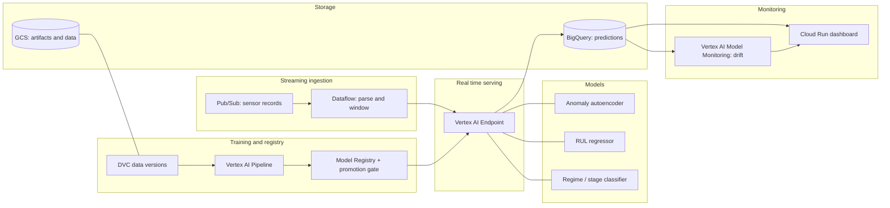

# Predictive Maintenance Platform for Industrial Turbofan Engines

An end to end MLOps platform that watches jet engine sensor streams, flags anomalies
before failure, predicts how many cycles of life an engine has left, classifies its
operating regime, and shows all of it to a maintenance engineer on a dashboard. It is
a system with cooperating models and a real streaming pipeline, not a single notebook
with a nice accuracy number.

Built on the NASA C-MAPSS turbofan degradation benchmark, running on Google Cloud
Vertex AI.

## Status

Early. Read this before you get excited.

What exists today: the repository scaffold, the documented architecture, the project
brief, and the `.claude` harness (subagents, skills, commands, and the hooks that keep
the work honest). What does not exist yet: the data loader, the models, the pipelines,
the serving endpoints, the streaming path, and the dashboard. Those are planned, scoped
into phases, and tracked as issues.

In other words, the foundation and the plan are here. The system is being built on top
of them in the open. The roadmap below is the honest version of what is done and what
is not.

## The problem

Unplanned equipment failure is expensive in the specific way that preventable things
are. The two common strategies are both bad. Run a machine until it breaks and you get
catastrophic, unscheduled downtime. Replace parts on a fixed calendar and you throw away
good components while still missing the ones that fail early. Predictive maintenance is
the third option: watch the machine, learn what healthy looks like, and predict failure
early enough to act on it but late enough that you are not scrapping parts with life
left in them.

This platform does that for turbofan engines. It ingests sensor streams, detects
degradation, estimates remaining useful life, identifies the operating regime, and
surfaces the result to a human who has to decide whether to pull an engine for service.

## The data

NASA C-MAPSS Turbofan Engine Degradation Simulation, the standard benchmark in the
prognostics and health management community. Each engine starts healthy with some random
initial wear, runs until it fails, and logs 21 sensor channels plus 3 operational
settings every cycle. The sensor readings carry deliberate noise, because real sensors
lie a little.

There are four subsets of increasing difficulty:

| Subset | Operating conditions | Fault modes | Train engines | Test engines |
|--------|----------------------|-------------|---------------|--------------|
| FD001  | 1                    | 1           | 100           | 100          |
| FD002  | 6                    | 1           | 260           | 259          |
| FD003  | 1                    | 2           | 100           | 100          |
| FD004  | 6                    | 2           | 248           | 249          |

The plan is to get the whole pipeline working on FD001 first because it is the simplest,
then push to FD004, which has six operating conditions and two fault modes and is where
the project actually gets interesting. Stopping at FD001 is the version interviewers have
seen a hundred times.

Download it from Kaggle: https://www.kaggle.com/datasets/behrad3d/nasa-cmaps

Data is versioned with DVC against a GCS remote and is never committed to git. The
pointer lives in the repo, the bytes live in the bucket.

## The models

Three cooperating models that share one feature implementation:

1. **Anomaly detection.** An autoencoder trained only on early-life, healthy sensor
   windows. As an engine degrades, reconstruction error climbs and the system flags it.
   Unsupervised, so no failure labels are needed.
2. **Remaining useful life (RUL).** A regressor that predicts how many cycles an engine
   has left. This is exactly what the dataset was built for, and the ground truth is
   provided.
3. **Regime or degradation-stage classifier.** An honest note here, because it matters.
   C-MAPSS does not ship a per-row fault-type label, so this platform does not pretend to
   classify fault types from labels that do not exist. Instead it classifies something
   the data actually supports: the operating regime (six regimes in the multi-condition
   subsets) or the degradation stage (healthy, degrading, critical, bucketed from RUL
   thresholds). The model card states which framing is used and why. Being honest about
   what the labels can support is itself the point.

### The metric that actually matters

For RUL, plain RMSE is not the scoreboard. In maintenance, a late prediction is much
worse than an early one. An early prediction wastes a little life. A late prediction
means the engine failed in service. Evaluation uses the asymmetric C-MAPSS scoring
function from the original PHM08 challenge, which penalizes late predictions harder than
early ones. Every model card and every evaluation states this. It is the difference
between someone who ran a regression and someone who understood the problem.

## Architecture



The streaming path replays test trajectories through Pub/Sub as if they were live, so the
system handles a real stream and not just a static file. Dataflow consumes the stream,
builds features with the same code used at training time, calls the endpoint, and writes
results to BigQuery. Monitoring watches the input and prediction distributions for drift
and alerts a human before a user would notice.

The full description, including the GCP service mapping and the design decisions, lives in
[docs/architecture.md](docs/architecture.md). The why lives in
[docs/PROJECT_BRIEF.md](docs/PROJECT_BRIEF.md).

## Repository structure

The target layout. Directories marked planned do not exist yet and will arrive with the
phases that need them.

```
.
├── README.md
├── CLAUDE.md                the repository constitution, read it
├── docs/                    architecture, brief, data dictionary, model cards, runbooks
├── src/                     planned: ingestion, features, models, pipelines, serving, monitoring
├── tests/                   planned: mirrors src/
├── examples/                planned: runnable end to end examples
├── scripts/                 planned: setup, deploy, common tasks
├── notebooks/               planned: exploration only, never imported by src
├── configs/                 planned: hyperparameters, paths, env configs
├── .github/                 issue templates, PR template, workflows
└── .claude/                 the harness that builds and maintains this repo
```

## Getting started

What you can do today:

1. Clone the repo and read `CLAUDE.md` and `.claude/README.md`. They explain the rules
   and the tooling.
2. Read [docs/PROJECT_BRIEF.md](docs/PROJECT_BRIEF.md) for the full why and the phased
   build plan.
3. Set up the MCP servers if you are working with Claude Code. Copy the template and add
   your own token:

   ```bash
   cp .mcp.json.example .mcp.json
   export GITHUB_PERSONAL_ACCESS_TOKEN=your_token_here
   ```

   The real `.mcp.json` is gitignored on purpose, because it holds a token and tokens do
   not belong in a public repository.

What you will be able to do once the relevant phases land: pull the dataset with DVC,
load FD001 in one command, train a model, run the pipeline, and hit a live endpoint. The
roadmap says which phase delivers which capability.

## Development workflow

This repo is opinionated and the opinions are enforced by hooks. The short version:

- Every change traces to a GitHub issue. Use the templates in `.github/ISSUE_TEMPLATE/`.
- Branch, then open a pull request. No direct pushes to `main`.
- Conventional Commits, lowercase, imperative, scoped: `feat(rul): add lstm baseline`.
- Tests ship with the code that needs them.
- CI runs ruff and pytest on every pull request. Green is not optional.
- No secrets, ever. No tool attribution on commits.

`CLAUDE.md` is the full constitution. The hooks in `.claude/hooks/` enforce the
non-negotiable parts so nobody has to rely on memory.

## Roadmap

Each phase is a milestone, each task is an issue.

- **Phase 0, Foundations.** Scaffold, harness, CI skeleton, DVC remote, FD001 loader.
  Definition of done: clone the repo, pull the data, load FD001 in one documented
  command.
- **Phase 1, One model end to end on FD001.** Shared feature engineering, the RUL
  regressor, and a Vertex AI Pipeline that trains, evaluates against the asymmetric
  metric, and registers if it passes the gate.
- **Phase 2, The other two models.** Anomaly autoencoder and the regime or stage
  classifier, three model cards, one shared feature pipeline.
- **Phase 3, Serving.** Vertex AI Endpoints plus batch prediction, a service that returns
  anomaly score, RUL, and stage together.
- **Phase 4, Streaming.** Pub/Sub publisher replaying trajectories, Dataflow consuming
  and writing predictions to BigQuery with no manual step.
- **Phase 5, Monitoring and dashboard.** Drift detection, alerts that mean something,
  runbooks, and a Cloud Run dashboard an engineer actually looks at.
- **Phase 6, Hardening and scale.** Move from FD001 to FD004, handle six operating
  conditions and two fault modes, and write up honestly what the added complexity cost.

## The harness

This repo ships its own Claude Code setup in `.claude/`: specialist subagents, skills for
the repeatable MLOps procedures, commands for the common verbs, and hooks for the
guardrails. The index is in [.claude/README.md](.claude/README.md). It exists so the work
stays consistent and the guardrails are enforced by machines instead of memory.

## Citation

A. Saxena and K. Goebel (2008), "Turbofan Engine Degradation Simulation Data Set", NASA
Prognostics Data Repository, NASA Ames Research Center, Moffett Field, CA. Reference:
A. Saxena, K. Goebel, D. Simon, and N. Eklund, "Damage Propagation Modeling for Aircraft
Engine Run-to-Failure Simulation", PHM08, Denver, October 2008.

## License

Apache License 2.0. The full text is in [LICENSE](LICENSE). In short: use it, modify it,
and distribute it, including commercially, as long as you keep the copyright and license
notices and accept that it ships with no warranty. Apache 2.0 also carries an explicit
patent grant, which is the main reason to prefer it over MIT for something like this.
