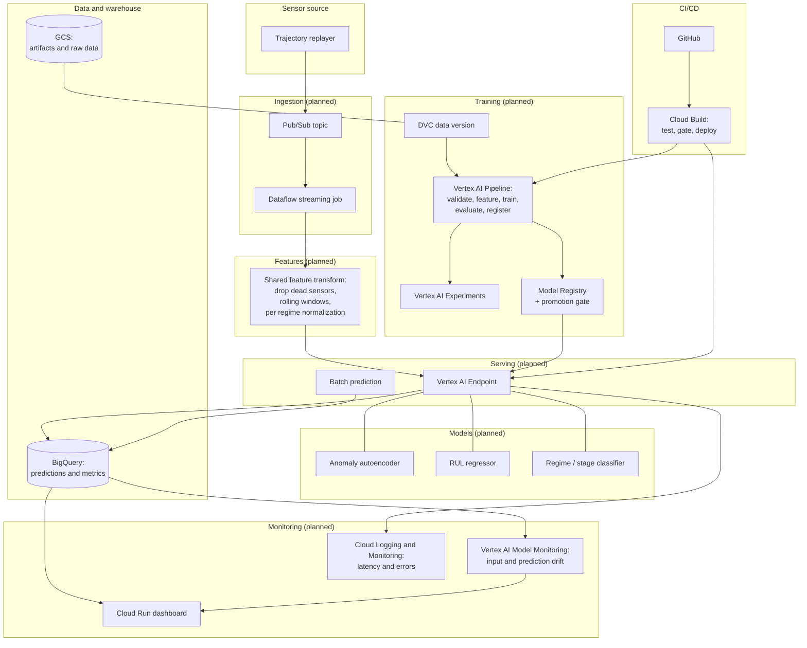

# Architecture

This is the how. For the why, read [PROJECT_BRIEF.md](PROJECT_BRIEF.md). For the rules of
the road, read [../CLAUDE.md](../CLAUDE.md). This document describes the target system and
notes which parts are built and which are still on paper.

## Status

The architecture below is the destination. As of now the repository holds the scaffold,
the harness, and the documentation. The runtime components (ingestion, models, pipelines,
serving, streaming, monitoring) are scoped into phases and not yet implemented. Each
section flags its state so nobody mistakes a diagram for a deployment.

## The shape of it

Four cooperating parts: streaming ingestion, three models behind one feature
implementation, real time and batch serving, and a monitoring layer that surfaces drift
and health to a human.

## Components

### Streaming ingestion

Pub/Sub publishes sensor records and a Dataflow streaming job consumes them. A replayer
reads C-MAPSS test trajectories and publishes them cycle by cycle, so the system handles a
live stream instead of a static file. This is the component most portfolio projects skip,
and it is the one that turns a model into a system.

State: planned, Phase 4.

### Features

One feature implementation, shared by training and serving, so there is no train and serve
skew. It drops the sensors that are flat constants and carry no signal, adds rolling
window statistics, and normalizes per operating regime, which matters because the
multi-condition subsets behave very differently across their six regimes. If the training
code and the serving code ever compute features differently, the models are quietly wrong,
so they use the same code.

State: planned, Phase 1.

### Models

Three models, described in full in the [README](../README.md) and each with its own model
card under `docs/` once trained.

- Anomaly autoencoder: trained on healthy windows, flags reconstruction error as
  degradation grows.
- RUL regressor: predicts remaining cycles, evaluated with the asymmetric C-MAPSS metric.
- Regime or degradation-stage classifier: an honest multiclass problem the data actually
  supports, with the labeling choice documented in its model card.

State: planned, Phases 1 and 2.

### Training, registry, and the promotion gate

Training runs as a Vertex AI Pipeline where each step is a container: validate the data,
engineer features, train, evaluate, register. Every run logs to Vertex AI Experiments
under the contract in the experiment-logging skill. A model reaches production by beating
the incumbent on the metric that matters, checked at a promotion gate, not by looking
good in a notebook.

State: planned, Phase 1.

### Serving

Vertex AI Endpoints for real time predictions and Batch Prediction for bulk scoring. A
prediction service takes a sensor window and returns the anomaly score, the RUL estimate,
and the stage together, so the caller gets one coherent answer instead of three
disconnected ones.

State: planned, Phase 3.

### Monitoring and the dashboard

Vertex AI Model Monitoring watches input and prediction distributions for drift. Cloud
Logging and Monitoring track latency and errors. A Cloud Run dashboard shows live engine
health, RUL, and anomalies to a maintenance engineer. Alert thresholds are set to mean
something, and each alert has a runbook so the human who gets paged knows what to do.

State: planned, Phase 5.

### Data versioning

DVC with a GCS remote. Every model traces to the exact data it was trained on. The data
never lives in git; the pointer does.

State: partially planned, Phase 0.

### CI/CD

Cloud Build, triggered by GitHub, runs tests and gates deployment on data and model
quality. A change does not ship because it merged. It ships because it passed.

State: skeleton in Phase 0, full gating alongside the pipeline.

## Design decisions worth defending

- **Asymmetric RUL scoring.** Late predictions are penalized harder than early ones,
  using the PHM08 C-MAPSS scoring function, because a late prediction means an in-service
  failure. Plain RMSE would hide exactly the errors that hurt most.
- **The third model is reframed honestly.** C-MAPSS has no per-row fault-type label, so the
  third model classifies operating regime or degradation stage, both of which the data
  genuinely supports. Claiming a fault-type classifier here would be a story a sharp
  reviewer takes apart in one question.
- **Shared features.** Training and serving compute features with the same code, so train
  and serve skew is structurally prevented rather than monitored for after the fact.
- **Promotion by metric, not by vibes.** The registry gate compares a candidate against the
  incumbent on the asymmetric metric before anything reaches an endpoint.

## Where to go next

- The phased build plan and definitions of done: [PROJECT_BRIEF.md](PROJECT_BRIEF.md).
- The rules, conventions, and golden rules: [../CLAUDE.md](../CLAUDE.md).
- The harness that enforces them: [../.claude/README.md](../.claude/README.md).
